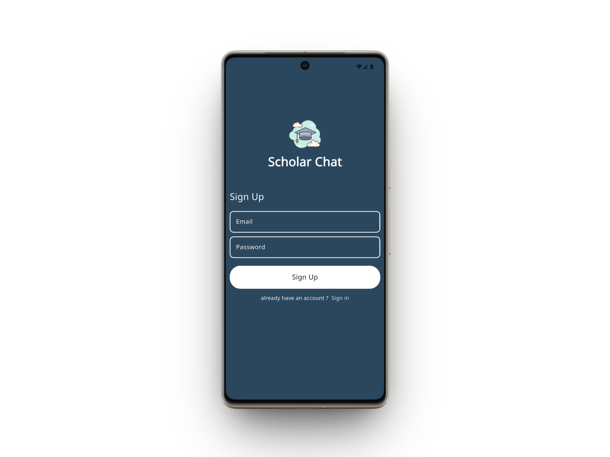
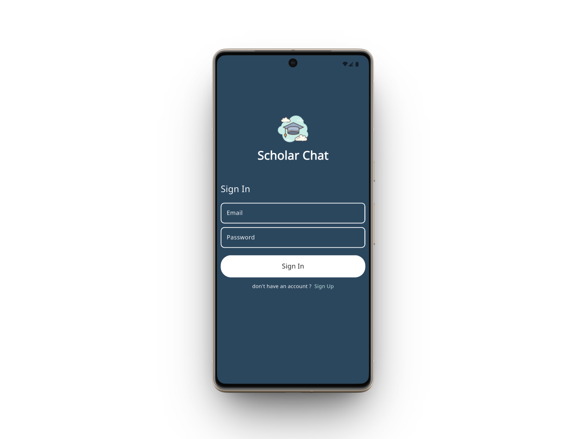
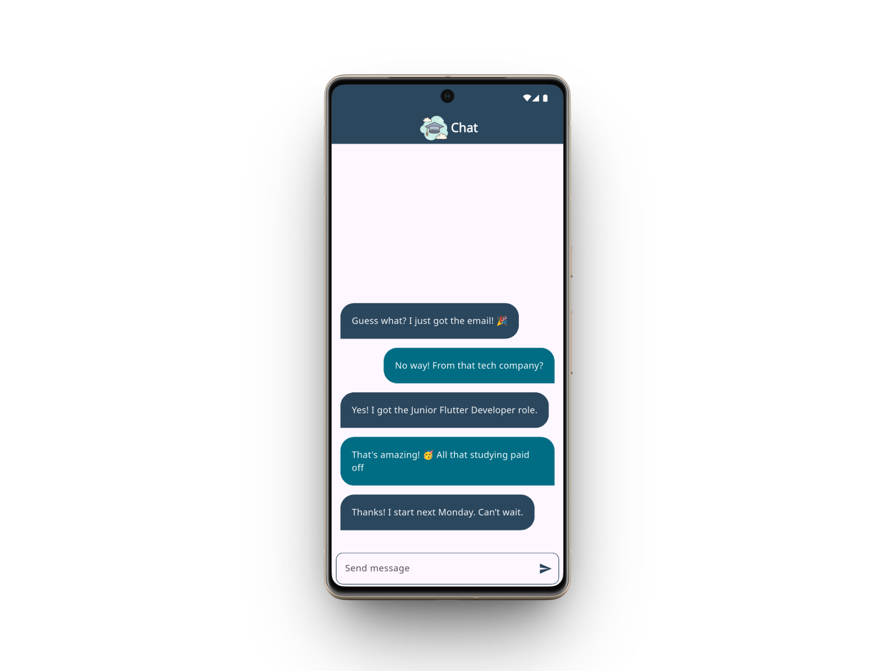

# 🎓 Scholar Chat

A modern, real-time messaging application built with **Flutter** and **Firebase**. Designed to facilitate seamless communication between students, graduates, and professionals.


## 📱 Screenshots

| Registration | Login | Chat |
|:---:|:---:|:---:|
|  |  |  |
| **Easy Sign Up** | **Secure Sign In** | **Real-time Conversation** |

## ✨ Features

* **Real-time Messaging:** Send and receive messages instantly using Cloud Firestore.
* **User Authentication:** Secure Sign Up and Log In functionality using Firebase Auth.
* **Smart Streams:** Chat interface updates automatically without refreshing the app.
* **Modern UI:** Clean, bubble-style chat interface with auto-scrolling.

## 🛠️ Tech Stack

* **Framework:** Flutter
* **Backend:** Firebase (Core, Auth, Cloud Firestore)
* **State Management:** StreamBuilder / setState
* **UI Components:** Custom Buttons, Modal Progress HUD (for loading states).

## 🚀 How to Run

> **Note:** Since this app uses Firebase, you must add your own `google-services.json` file for Android (or `GoogleService-Info.plist` for iOS).

1.  **Clone the repository:**
    ```bash
    git clone [https://github.com/your-username/scholar-chat.git](https://github.com/your-username/scholar-chat.git)
    ```

2.  **Install dependencies:**
    ```bash
    cd scholar_chat
    flutter pub get
    ```

3.  **Firebase Setup:**
    * Create a project on the [Firebase Console](https://console.firebase.google.com/).
    * Add an Android app and download `google-services.json`.
    * Place the file in `android/app/`.
    * Enable **Authentication (Email/Password)** and **Cloud Firestore** in the console.

4.  **Run the app:**
    ```bash
    flutter run
    ```
## 📂 Project Structure

```text
lib/
├── helper/          # Utility functions and shared logic
├── models/          # Data models (e.g., Message model)
├── screens/         # App screens (Login, Register, ChatPage)
├── widgets/         # Reusable UI components (ChatBubble, CustomButton)
└── main.dart        # Entry point
